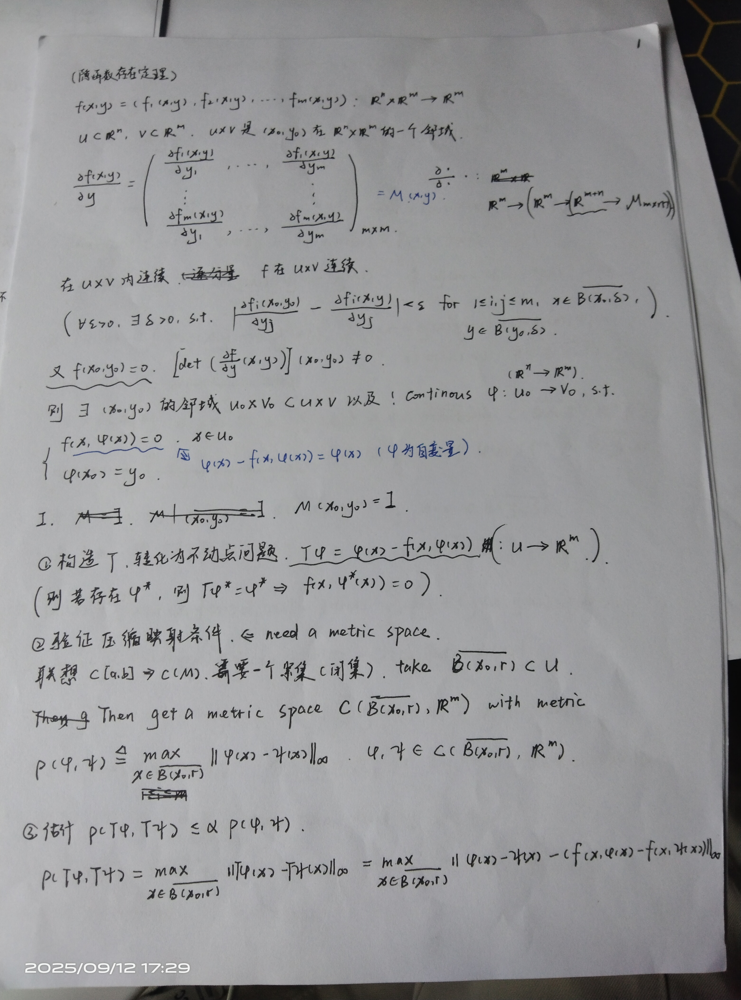
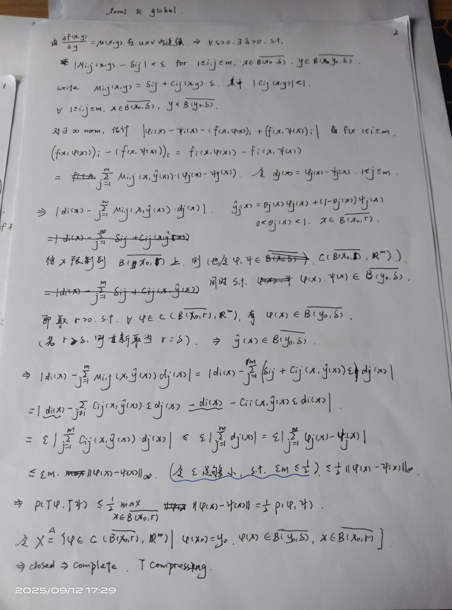
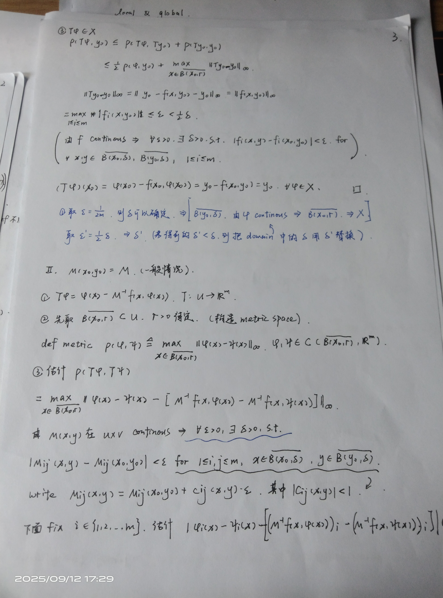
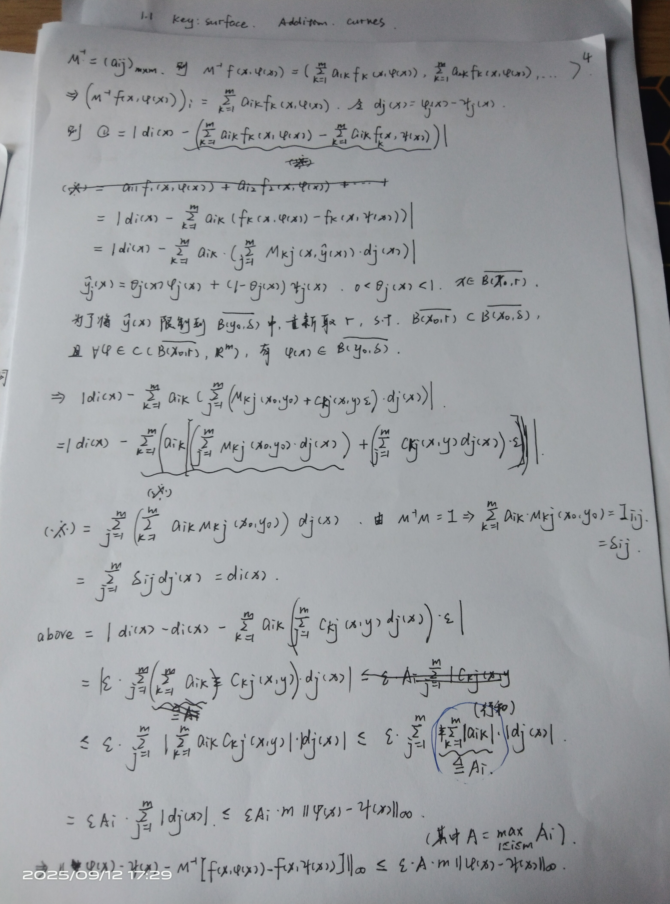
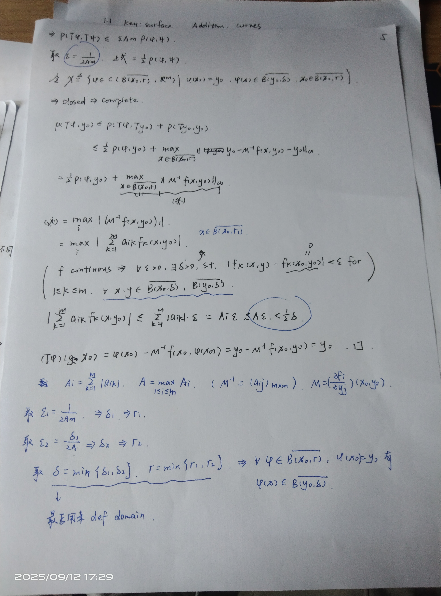

## 1 Metric Space

### 1.1 压缩映射原理

将数学分析中的一些概念和性质，抽象出其本质到度量空间上

#### basic concepts 1

- metric
- convergence
- closed set
- Cauchy sequence
- complete space

##### examples

- *欧几里得空间
- *连续函数空间取最大值度量

#### basic concepts 2

- continous map
- 压缩映射
- 不动点

#### Theorem and applications

- *压缩映射原理（皮卡迭代）

---

先将问题转化为不动点问题

- *ode初值问题
- *隐函数定理

---

隐函数定理证明

