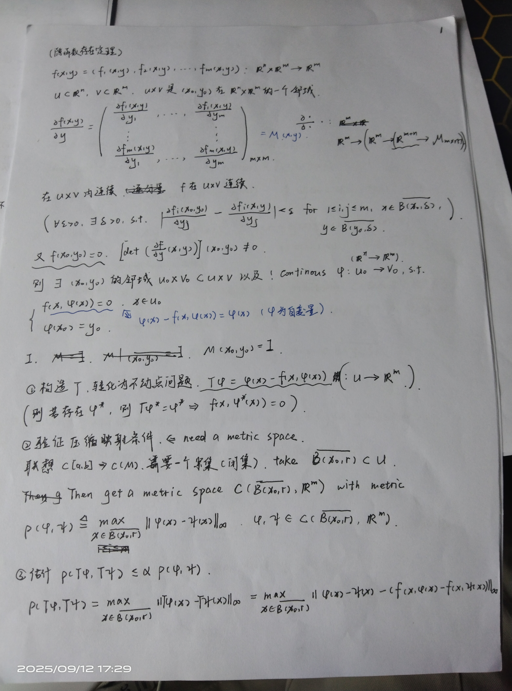
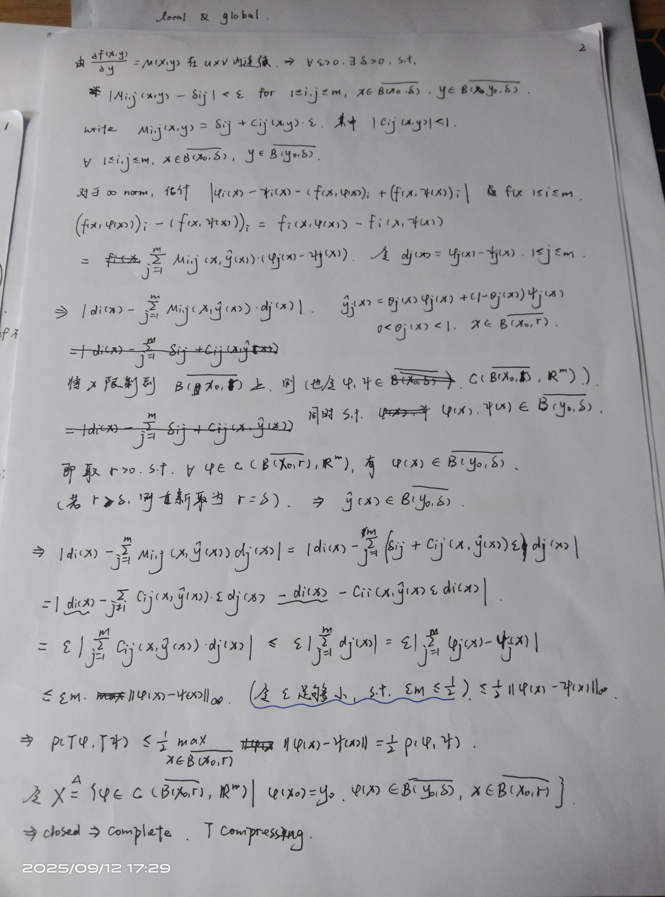
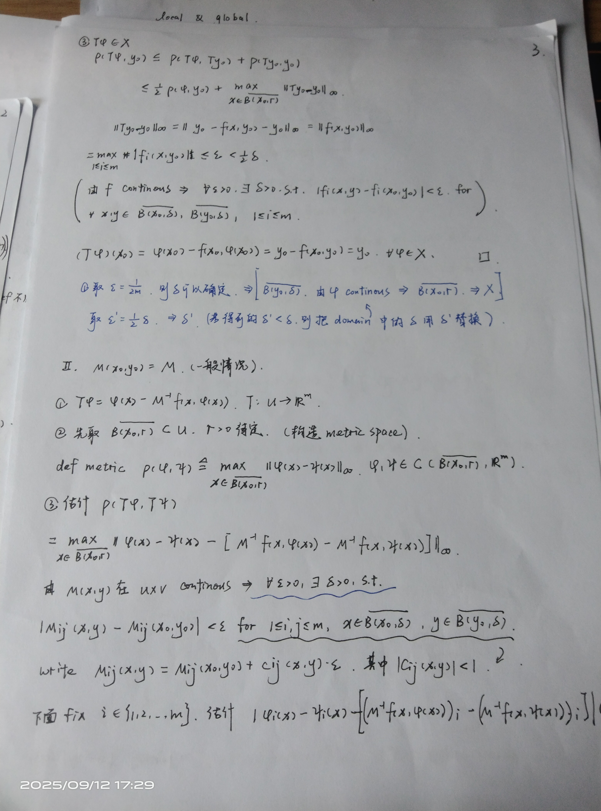
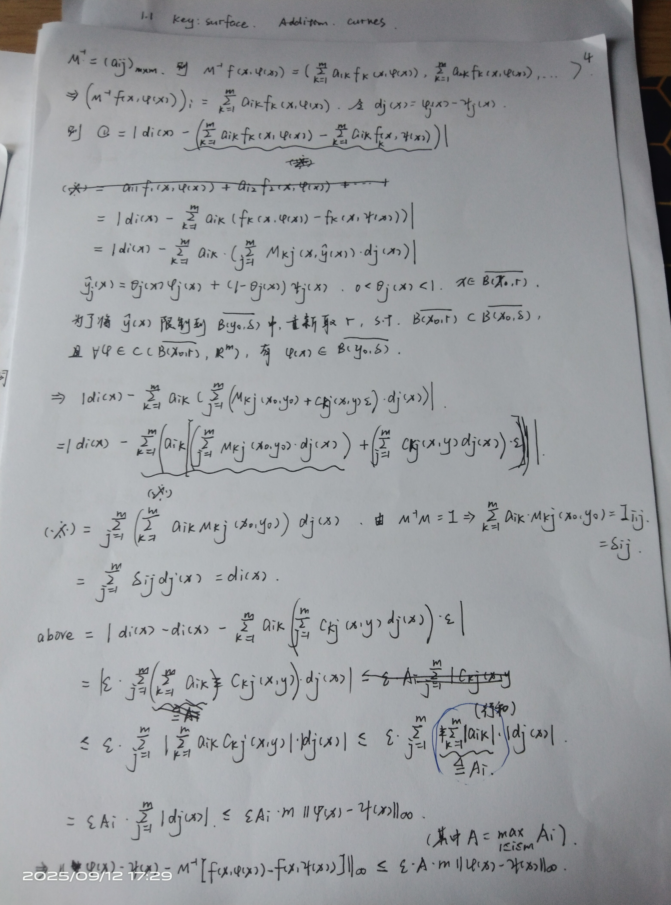
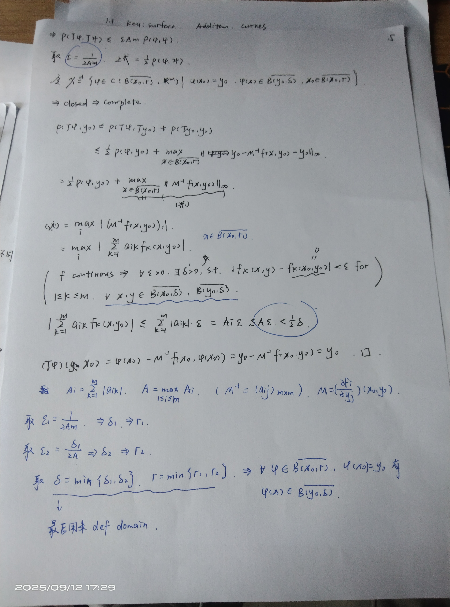

## 1 Metric Space

### 1.1 压缩映射原理

将数学分析中的一些概念和性质，抽象出其本质到度量空间上

#### basic concepts 1

- metric
- convergence
- closed set
- Cauchy sequence
- complete space

##### examples

- *欧几里得空间
- *连续函数空间取最大值度量

#### basic concepts 2

- continous map
- 压缩映射
- 不动点

#### Theorem and applications

- *压缩映射原理（皮卡迭代）

---

先将问题转化为不动点问题

- *ode初值问题
- *隐函数定理

---

隐函数定理证明

### completion

### Weierstrass 定理与列紧性

在数学分析中，我们学习过 Weierstrass 定理，即**有界集中的数列必有收敛子列**。但是在一般的度量空间中，这一定理不再成立。（回忆反例：$[0,1]$ 上的连续函数空间）

但我们仍然对这一性质感兴趣，于是将其抽出，命名为**列紧性**。一个十分有趣的性质是：列紧空间必定完备。其证明是基于 Cauchy 列收敛与存在收敛子列是等价的。

除了列紧性，我们还可以推广有界性，即**完全有界性**。在之后的定理中，我们可以看出**列紧性是相当强大的性质**。

>列紧性 $\implies$ 完全有界性；

>完全有界性 + 完备空间 $\implies$ 列紧性；

>而完全有界性 $\implies$ 可分性；

最后一个定理说明紧性比列紧性更强上一点：

>紧性 $\implies$ 自列紧性；

接下来考虑定义在紧集上的连续函数空间。他是一个完备空间。Arzelà-Ascoli 定理描述了一致有界、等度连续与列紧性的等价性。

### 赋范线性空间

为线性空间赋予范数后，不仅可以研究代数性质，还可以研究拓扑性质。而且由范数可以诱导度量，因此这还是一个度量空间。

其中最重要的是有限维的赋范线性空间。可以证明，有限维赋范线性空间中的范数都是等价的，因此相同维数的赋范线性空间不仅同构，而且同胚。

### 最佳逼近问题

赋范线性空间为估计大小提供了合适的度量，并且基于空间的性质，可以知道最佳逼近问题的最佳逼近系数是存在的。结合凸性可以得出最佳逼近系数的唯一性。

### 有限维 $B^*$ 空间的刻画

给定一个 $B^*$ 空间，dim B is finite $\iff$ 单位球面列紧。